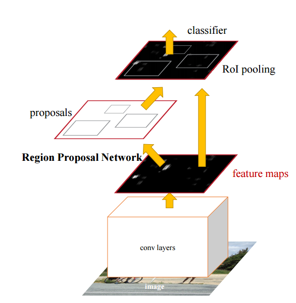

> (PDF)[http://arxiv.org/pdf/1506.01497v3.pdf]

## Summary

Faster-RCNN introduces a Region Proposal Network (RPN) that shares full-image convolutional features with detection network to reduce region proposal time, and therefore object recognition time. 5 FPS is achieved using RPN they proposed.

## Techniques

#### Architecture

#### Training
A 4-step training algorithm is adopted:

1. Finetune RPN using labeled image bounding boxes after initialized with ImageNet data
2. Train the classification network (initialized with IMageNet data) by Fast RCNN using proposals generated from step 1 RPN
3. Fix the shared convolutional layers, only fine-tune only the layers unique to RPN
4. Fix the shared convolutional layers, only fine-tune the layers unique to Fast RCNN